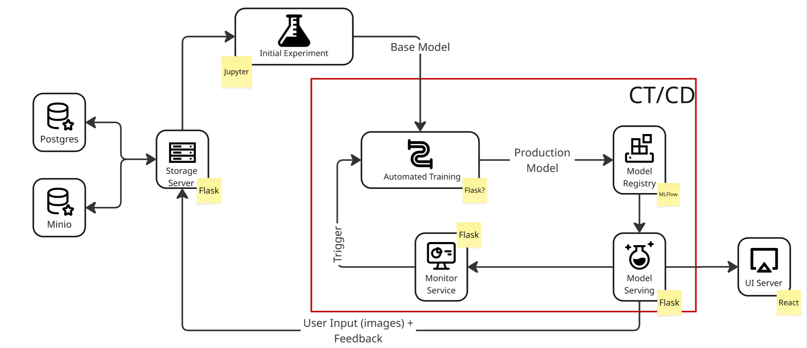
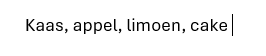
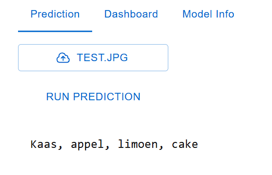

# 2-2-group-project

Year 2 Block 2 Project Repo.

# Overview
This repo tries to simulate an automated testing pipeline for an OCR model.

Logs are stored in a postgres DB, while images are stored 


 

# Getting started

The training and serving services are not dockerized.

1. Create docker container

```
docker-compose up
```

2. Install missing python dependencies for serving and training


3. Start Serving
Start serving service

(Wait for serving to fully download the model)

```
cd serving

py main.py
```

4. Start Training
Unzip all_data.zip in /training

Start training

```
cd training

py main.py
```

Call http://localhost:3004/train to run training (Requires Nvidia GPU)

# Getting a Prediction

1. Open http://localhost:3000

2. Press 'Upload a file' (Only .jpg)

 

3. Run prediction

 